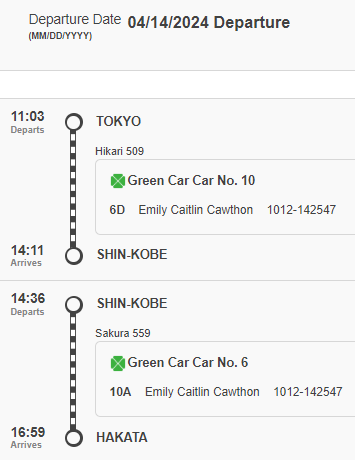

  

  
  April 14   Tokyo -> Hakata 11:03-16:59  

  

  
April 22 Hakata -> Kyoto 11:23-14:39

![[Pasted image 20240409234933.png]]

  

  

April 27 Kyoto -> Hakata 12:10 - 15:23

![[Pasted image 20240409234907.png]]

  

  

April 29 Hakata -> Hiroshima 8:23-9:32

![[Pasted image 20240409234821.png]]

  

  

April 29 Hiroshima -> Hakata 20:51-21:59

![[Pasted image 20240409234755.png]]

  

  

April 30 Hakata -> Hiroshima 8:23-9:32

![[Pasted image 20240409235051.png]]

  

  

April 30 Hirshima -> Hakata 18:52-19:59

![[Pasted image 20240409235127.png]]

