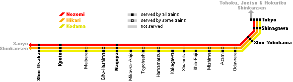
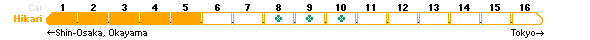

The Hikari is the second fastest train category along the Tokaido Shinkansen, serving a few more stations than the Nozomi and requiring about three hours to reach Shin-Osaka from Tokyo. There are two departures per hour in each direction, one operating between Tokyo and Shin-Osaka and the other between Tokyo and Okayama on the Sanyo Shinkansen.

