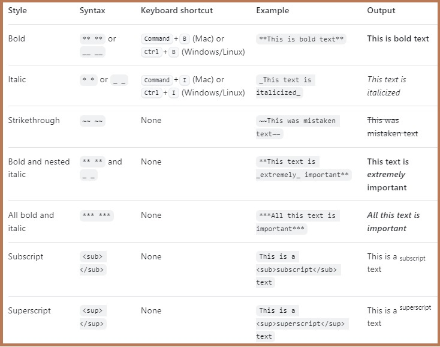

\|Table \| column \| third \|
\| \-\-\- \| \-\-\- \| \-\-\- |
\| cell 1 \| cell2 \| cell 3 \|
```
Markdown | Less | Pretty
--- | --- | ---
*Still* | `renders` | **nicely**
1 | 2 | 3
```

Markdown | Less | Pretty
--- | --- | ---
\**Still*\* | \``renders`\` | \*\***nicely**\*\*
1 | 2 | 3

# # H1  

## ## H2  

### ### H3  

**\*\*bold text\*\***  
*\*italics\**
\~\~~~strikethrough~~\~\~
\<sub\><sub>subscript</sub>\<\/sub\>
\<sup\><sup>superscript</sup>\<\/sup\>

>blockquote  
>what?

- [x] \- \[x \] a check box
- [ ] \- \[ \] an empty box

lists:
1. first
2. second
3. third
   - \- first nested
     - \- second nested
       - \- third nested
	 - \- what keeps happening?

`Copyright (©) — &copy;
Registered trademark (®) — &reg;  
Trademark (™) — &trade;  
Euro (€) — &euro;  
Left arrow (←) — &larr;  
Up arrow (↑) — &uarr;  
Right arrow (→) — &rarr;  
Down arrow (↓) — &darr;  
Degree (°) — &#176;
Pi (π) — &#960;`

` `code fits in here` ` 

``` ```more code here``` ```

\-\-\-Line
---
`[title](link)`
[title](link)  
``



